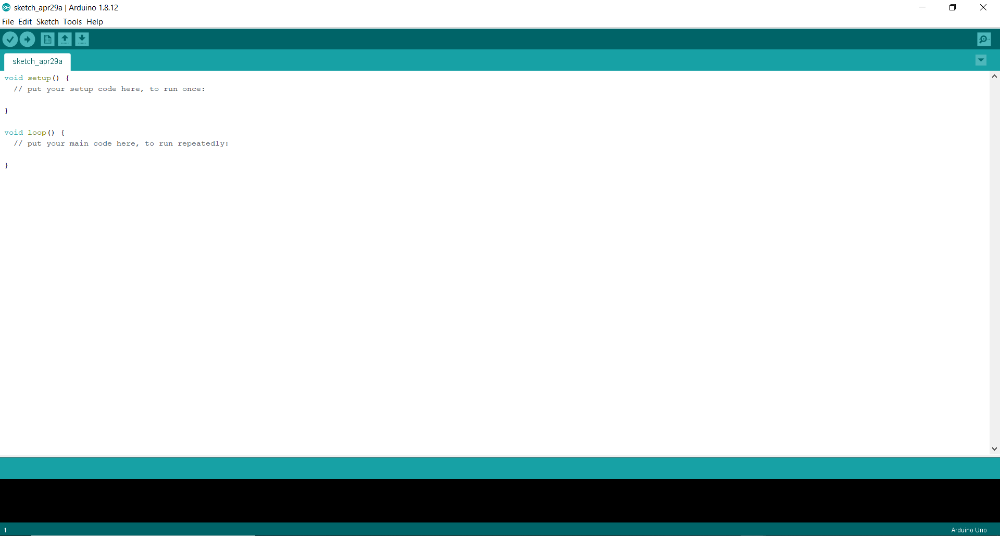
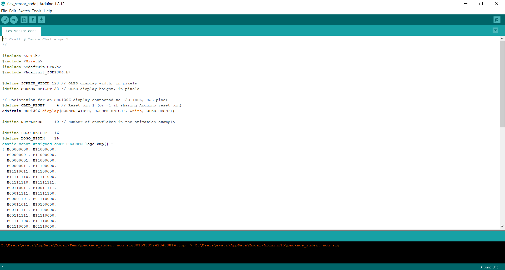

# Airway-Ventilation
Prototype for Emergency Airway Ventilation Training Device

# Hardware Assembly Guide

The components can be ordered online from any place like Adafruit, Mouse, DigiKey, Amazon, etc. The estimate total price is ~$35,
which is broken down as follows:

Metro Mini ~$12 

Flex sensor ~$8 

Display ~$5

Breadboard ~$3

Jumper wires ~$1

Balloons ~$2 

Tube ~$2

USB cable ~$2

Resistors ~$0.30

# Software Assembly Guide

The first step is to download the Arduino IDE, which can be found on https://www.arduino.cc/en/main/software

Once you have downloaded and installed the Arduino IDE, you should see a screen like the one below. 

Download the flex_sensor_code folder from this repository and open it using the Arduino IDE by clicking on File -> Open... and selecting the folder. Once the sketch is loaded, your screen should look like this:

Connect the Arduino to the computer using a USB cable. Make sure the right Board and Port options are selected by clicking on Tools. Next, 
click on Upload and wait for the code to be uploaded to the Arduino. 

You're all set now, great job!
